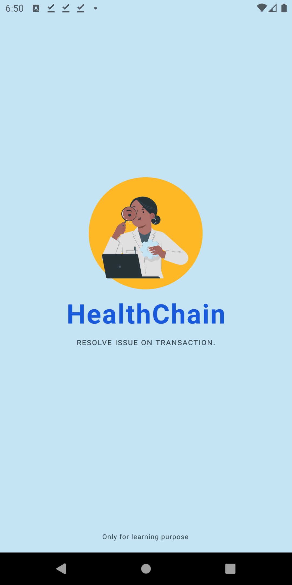

## HealthChain

> A `coin exchange` doctor appointment booking `mobile application`.

### Technologies used

- [Expo React-native](https://docs.expo.dev/get-started/create-a-new-app/)
- [Stripe-React-Native](https://github.com/stripe/stripe-react-native)
- [Firebase(Firestore, Realtime Database, Cloud Storage)](https://firebase.google.com/)
- [Native-Base](https://nativebase.io/)

### Idea of the Project

- After successfully install the app the user can `login` or `register` by creating an `account`.

- `Four` types of `professionalists(Doctor, X-Ray Technician, Pharmacist, Normal User)` can create a profile according to their profession.

- On `first time` create a profile a user will be `rewarded` `100 coins`.
- For `requesting an appointment` a normal user can create a request with some health description and a minimum of `30 coins` spend.
- On the other side `requested profile` can accept the `request` by set an `appointment` date according to his/her time and also the rewarded `coins` will be added to his/her account.
- After successfully schedule accepted both(`requesting side and requested side`) can get `communicate` by `real-time chat`.
- Anyone can `upvote` or `downvote` any profile as per their `experience`.
- Any time any user can `buy coins` as per their `requirements`.

### [Click here to Download APK ](https://drive.google.com/file/d/1nqgq-I8vvfg6sRZwbOrfoe6J6Ggv_SX8/view?usp=sharing)

### Screenshots

  <div style="display:flex;">
    
    
  </div>
  <div style="display:flex;">
     
     
  </div>
  <div style="display:flex;">
    
    
  </div>
  <div style="display:flex;">
    
    
  </div>

- ### [Click Here For More ScreenShots](https://drive.google.com/drive/folders/1u56KvE4-nM8W9824s8qtrvVn9tVefxvW?usp=sharing)

## Development Setup

### Firebase setup

- Make sure create a project in `firebase console`, then `add an app(web)` and `copy paste` all the required `config keys` inside a `.env` file in the root of the project.
- Again inside `firebase` `add an app(android)` and download the `google-services-json` and place it in the `root` of the project.
- Run this to install all the `required dependencies.`

```
npm i (or) yarn
```

- Make sure you have set up android simulator set up inside your system or else you can download [Expo Go App](https://play.google.com/store/apps/details?id=host.exp.exponent&hl=en_IN&gl=US) and run the application from there.
- Run this to run the `app` in development.

```
npm run start (or) yarn start
```
